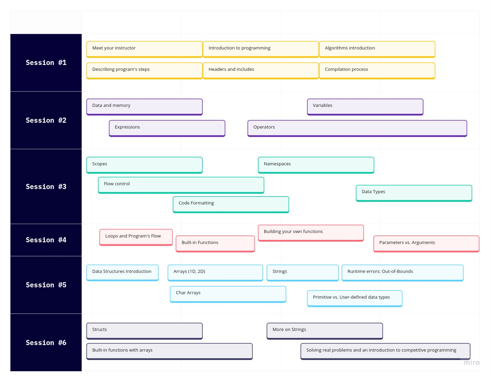

# ICPC SCU Community Training Repository (2023-2024)

Welcome to the ICPC SCU Community's training repository for the First Training Batch of 2023-2024. This repository contains a collection of valuable resources to help you on your journey in the world of programming and competitive programming. You'll find slides, recorded sessions, and additional materials for every session.

## Sessions Overview

This diagram shows just an overview of the whole content. The actual content may be changed or altered, and the order of sessions' content may differ during the program if needed.

### [Session #1: Introduction](session-1/)
- In this session, we provide an overview of the training program and what you can expect. It also has an introduction to some simple definitions such as Programming Languages, Algorithms, Headers and Includes, and Compilation Process. 
- [Session Details](session-1/)

### [Session #2: Memory, Data, Variables, and Operators](session-2/)
- Explore the fundamental concepts about memory, data, variables, operators, expressoins, and evaluation explained in a clear and concise way.
- [Session Details](session-2/)

### [Session #3: Data Types, Scopes, and Conditionals](session-3/)
- Explore the fundametnal concepts about data types in C++, scopes, conditional structures, control flow, namespaces, and cin and cout streams.
- [Session Details](session-3/)

<!-- 
### [Session #4: Problem Solving](session4/)
- Improve your problem-solving skills with hands-on practice.
- [Session Details](session4/) -->

## Additional Resources

In addition to the sessions, you can find supplementary materials and resources in the [Additional Resources](additional-resources/) directory.

## Feedback and Contributions

We welcome your feedback and contributions to make this training program even more valuable. If you have suggestions, found issues, please feel free to open an issue or create a pull request.

***Happy learning and programming!***
