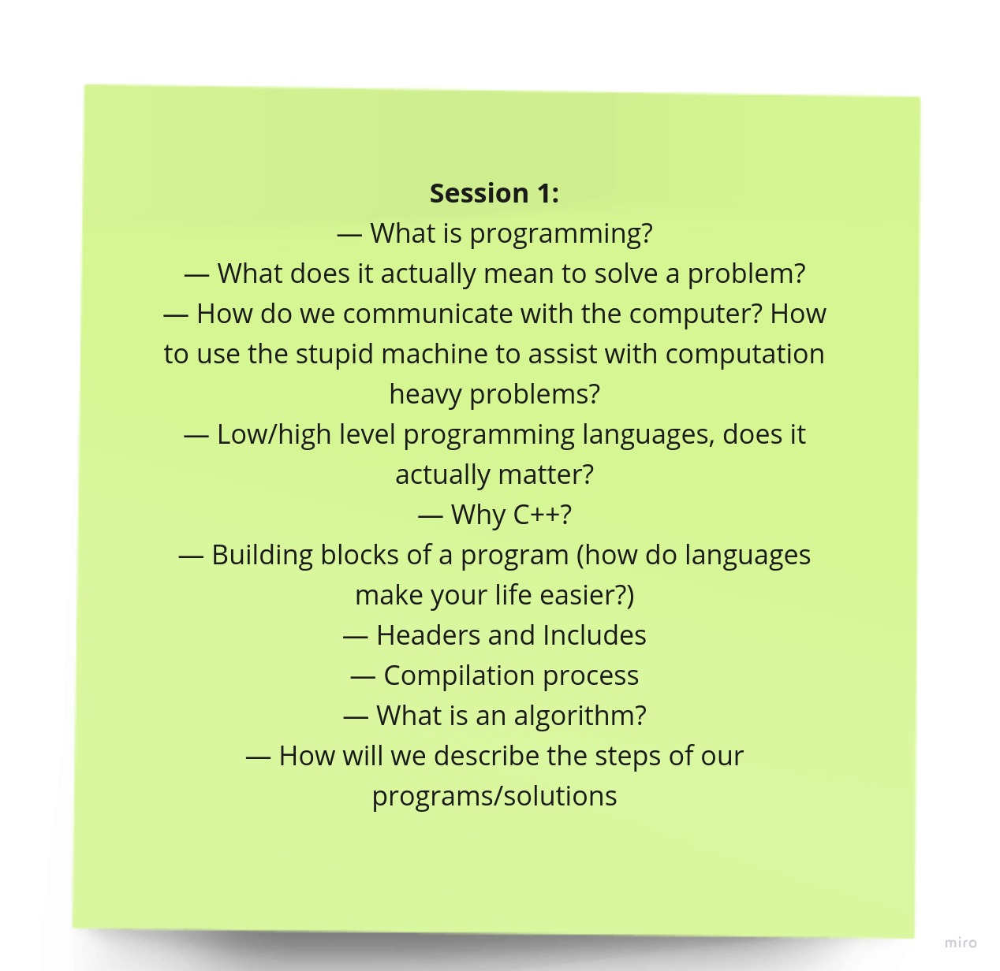

# Session 1

Welcome to the first session of our training program! This README provides an introduction to the session and outlines what you can expect to learn. We'll also cover some fundamental definitions related to programming and software development.

## Introduction

In this session, we will introduce you to the world of programming. Whether you're a complete beginner or have some prior experience, this session will lay the foundation for the rest of the program.

## What to Expect

During this session, you can expect to:

- Gain an understanding of key programming concepts.
- Learn about the compilation process and name some important phases of the process.
- Get familiar with common programming languages and their roles.
- Explore the importance of algorithms in software development.
- Understand the significance of headers and includes in C/C++ programming.

## Fundamental Definitions

Here are some fundamental definitions that we'll be discussing in this session:

1. **Algorithms**: Algorithms are step-by-step procedures for solving a specific problem or accomplishing a particular task. They serve as the building blocks of software development, providing a clear plan for solving problems.

2. **Headers and Includes**: In C/C++ programming, headers are files that contain declarations and definitions for functions, variables, and other program elements. Includes are used to incorporate these headers into your code, allowing you to access their functionality.

3. **Compilation Process**: Compilation is the process of translating your source code into machine code that can be executed by a computer. It involves several stages, including preprocessing, compilation, assembly, and linking.

4. **Programming Languages**: Programming languages are tools that developers use to write and communicate instructions to computers. Common programming languages include Python, Java, C++, and many more.

## Session Materials

- [Session Slides (PDF)](session-1-slides.pdf) - Download the session slides to follow along.

- [Recorded Session (YouTube)](https://youtu.be/_39mqS5sexI?si=Nafl4gUV_W2hs_-3) - If you missed the live session, you can watch the recorded video on my YouTube channel.

We look forward to having you in our sessions! If you have any questions or need further assistance, please feel free to reach out.

***Happy learning!***
