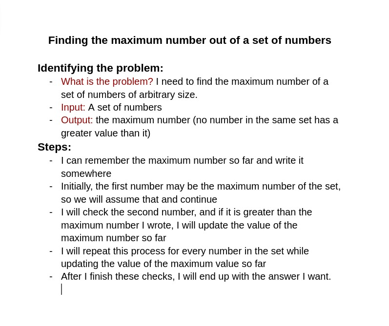

# Task #1 Solution

## Below you could find my comments:

### Arabic:

دا الحاجة اللي انا كنت متخيلها وطالبها في التاسك، وبإذن الله هنتبع نفس الطريقة في التاسكات اللي هطلب فيها steps 

طبيعي انك في الاول متكنش عارف تتخيل الموضوع للدرجة بس أحسن حاجة في العموم انك تسرح بخيالك وتحاول توصل لأكتر حاجة تقدر توصلها وبعدين تشوف reference وتreflect على اللي انت عملته 

هنا هناخد بالنا اني كنت محتاج بس منكم انكم تعرفوا تحددوا ايه المشكلة اللي بحاول احلها، ورغم انها بسيطة جدًا في ناس اخترعت مشاكل وحاولت تحلها مع ان المشكلة واضحة جدًا (حاول تفكر ببساطة قبل ما تعقد الدنيا)

تاني حاجة الinput، حاولوا متفترضوش حاجات من عندكم غير لو بتتأكدوا ان فعلًا الحل بتاعكم هيشتغل عليها مش اكتر، غير كدا لما احددلك مجموعة ارقام توقع انها ممكن تبقى اي عدد متخصصش حاجة زي رقم او اتنين او تلاتة وتعمل حل على الأساس دا، لأن ساعات كتير الحالة اللي انت اخترتها هتكون مُضللة 

تالت حاجة ان بعض الناس اللي عندهم خلفية برمجة -ودي حاجة حلوة مش وحشة-  راحوا لنحية انهم يكتبوا في الsteps كود او building blocks خاصة باللغة وغيرها (على قد ما دا حلو على قد ما هو وحش)

ليه على قد ما هو حلو على قد ما هو وحش؟ 
انا حابب انك دلوقتي تعرف تفكر وتحل بشوية tools محدودة انا مديهالك (كلام انجلش والمنطق)، محتاجك تعرف تعبر عن أفكارك في كلام وتقدر توصله لنفسك وللناس

لأن بعد كدا بإذن الله وانت بتحل مشاكل معقدة أكتر وأصعب هتحتاج انك توصل لأكتر حاجة بسيطة تقدر توصلها قبل ما تبدأ تكتب كود عشان المشكلة متتعقدش أكتر بالنسبالك

### English:

This is what I was expecting and requesting in the task, and, God willing, we will follow the same approach in the tasks where I will request steps.

It's natural that at first, you might not fully understand the topic, but the best thing you can do is to let your imagination run wild and try to reach the most you can. Afterward, you should look at references and reflect on what you've done.

Here, we need to keep in mind that I only need you to be able to identify the problem you're trying to solve, even if it's very simple. Some people have created problems and tried to solve them, even though the problem is very clear (try to think simply before complicating things).

Another thing is about the input; try not to assume things beyond what you are sure of. Also, when I specify a set of numbers, don't specialize in one specific number like one, two, or three and build your solution based on that because sometimes the case you chose can be misleading.

The third thing is that some people with a programming background, which is a good thing, not a bad thing, have gone to the extent of writing code or building blocks specific to the language, and others (as nice as it is, it can also be bad).

Why can it be bad? I want you to be able to think and solve with some limited tools that I'm providing (English and logic). I need you to express your ideas in words and convey them to yourself and others.

Because after that, God willing, when you solve more complex and harder problems, you will need to reach the simplest thing you can before you start writing code, so the problem doesn't become even more complicated for you.