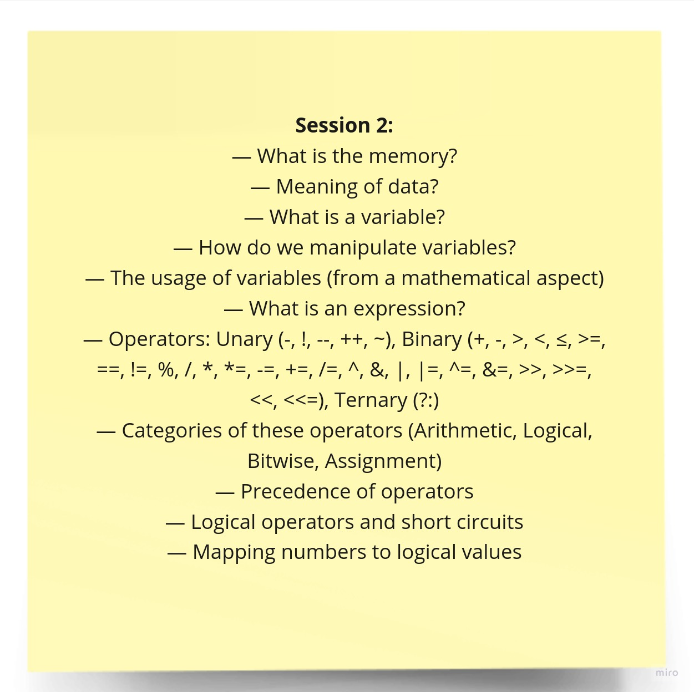

# Session 2

Welcome to the second session of our training program! This README provides an introduction to the session and covers foundational topics related to programming and data manipulation. We will explore key concepts and definitions that will be crucial for your journey in programming.

## Introduction

In this session, we will delve into foundational topics that form the basis of programming and data. Understanding these concepts is essential as they serve as building blocks for more advanced programming tasks.

## Topics Covered

Here are some of the key topics we will cover in this session:

1. **Memory**: Memory is where a computer stores and retrieves data for processing. We'll discuss the memory and the role of RAM (Random Access Memory) in program execution.

2. **Data**: We will explore what data is and how it's represented in a computer's memory. Data can take various forms, including numbers, text, and more.

3. **Variables and Their Uses**: Variables are used to store and manage data in a program. We will learn how to use variables to hold different types of data.

4. **Expressions**: Expressions are combinations of variables, values, and operators that produce a result. We will examine how to create and evaluate expressions.

5. **Operators and Operands**: Operators are symbols used to perform operations on operands. We will discuss common operators in C++ and how they manipulate data.

6. **Short-Circuit Evaluation**: Short-circuit evaluation is a programming technique that can improve the efficiency and performance of your code. We'll explore how it works and when to use it.

7. **Mapping Numbers to Boolean Values in C++**: In C++, numbers can be mapped to boolean values (true or false). We will cover how this is done and its significance in decision-making.

## Session Materials

- [Session Slides (PDF)](session-2-slides.pdf) - Download the session slides to follow along.

- [Recorded Session (YouTube)](https://youtu.be/kiBbmZsHQQ4?si=_pu4xv0H3fc2eO7f) - If you missed the live session, you can watch the recorded video on our YouTube channel.

- [Task Solution (PDF)](session-2-task-solution/) - After trying to solve the task yourself, you should benefit of being mentored by someone with higher experience and compare your solution with him to improve faster.

We hope you find this session informative and valuable as you continue your journey in programming. If you have any questions or need further assistance, please feel free to reach out.

***Happy learning!***
