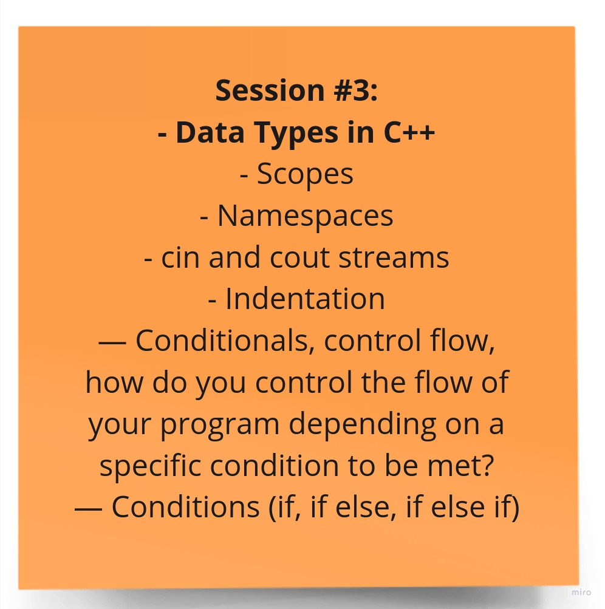

# Session 3

Welcome to the third session of the Introduction to Programming training! In this session, we covered several foundational concepts in C++ programming. These concepts are crucial for building a strong understanding of the language and its core principles.

## Topics Covered

Here are some of the key topics we will cover in this session:

1. **Data Types in C++**: In this session, we delved into the concept of data types in C++. Data types determine the kind of data that can be stored in variables. We explored various built-in data types such as int, double, char, and how to declare and use them. Understanding data types is essential for creating efficient and error-free programs.

2. **Scopes and Namespaces**: Scopes define the visibility and lifetime of variables in C++. We discussed the scope of variables and how they can be defined within different code blocks. Namespaces were introduced as a way to organize and avoid naming conflicts in larger codebases.

3. **Variables and Their Uses**: Variables are used to store and manage data in a program. We will learn how to use variables to hold different types of data.

4. **Indentation**: Proper code indentation is essential for code readability and maintainability. We discussed the importance of consistent indentation and coding style in C++ programming. Well-structured code is easier to understand and maintain.

5. **Input and Output Streams (cin and cout)**: We learned how to read input from the user using cin and how to display output to the console using cout. These are essential for interacting with the user and for debugging purposes.

6. **Conditional Statements**: Conditional statements, including if, else if, and else, were introduced as a way to make decisions in a program. We explored how to use conditionals to control the flow of the program based on different conditions.

## Session Materials

- [Session Slides (PDF)](session-3-slides.pdf) - Download the session slides to follow along.

- [Recorded Session (YouTube)](https://youtu.be/LQfL7YJ0giw?si=PJbZIKq0wvkYwElX) - If you missed the live session, you can watch the recorded video on our YouTube channel.

- [Task Solution (PDF)](session-3-task-solution/) - After trying to solve the task yourself, you should benefit of being mentored by someone with higher experience and compare your solution with him to improve faster.

We hope you find this session informative and valuable as you continue your journey in programming. If you have any questions or need further assistance, please feel free to reach out.

***Happy learning!***
