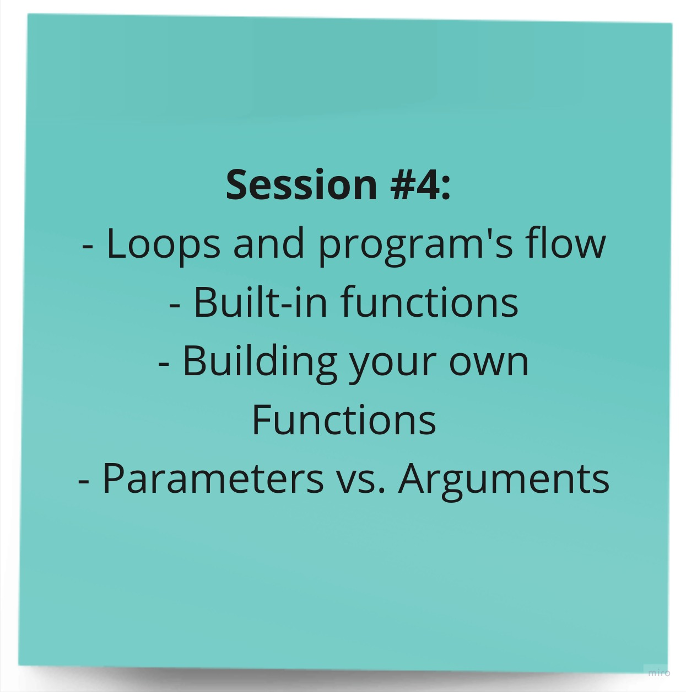

# Session 4

Welcome to the fourth session of the Introduction to Programming training! In this session, we covered more foundational concepts in C++ programming. These concepts are crucial for building a strong understanding of the language and its core principles as well.

## Topics Covered

Here are some of the key topics we will cover in this session:

## Programming Building Blocks

### Loops

Loops are control flow statements that allow a block of code to be executed repeatedly until a certain condition is met. They are essential for performing repetitive tasks efficiently.

### Built-in Functions

Built-in functions are predefined functions that are provided by the programming language and can be used without needing to define them explicitly. They provide a wide range of functionalities, such as mathematical operations, input/output operations, and string manipulation.

#### Example C++ Built-in Functions:

* `pow(x, y)`: Calculates the power of x raised to the power of y.
* `sqrt(x)`: Calculates the square root of x.
* `abs(x)`: Calculates the absolute value of x.

### Custom Functions

Custom functions are functions that we define ourselves to encapsulate specific tasks or functionalities. They promote code modularity, reusability, and maintainability.

### Return Statements

Return statements are used to specify the value that a function returns. They allow functions to provide output or data to the calling code.

### Parameters vs Arguments

Parameters are the variables declared within a function definition, while arguments are the actual values passed to the function when it is called. Parameters act as placeholders for the arguments.

### Use Cases for Programming Building Blocks

#### Loops:

* Iterating through a collection of data, such as an array or a list.
* Performing repetitive computations based on a condition.

#### Built-in Functions:

* Performing common mathematical operations, such as addition, subtraction, multiplication, and division.
* Handling input/output operations, such as reading user input or writing data to a file.
* Manipulating strings, such as searching for characters, extracting substrings, and converting between uppercase and lowercase.

#### Custom Functions:

* Encapsulating specific tasks or functionalities to improve code organization and readability.
* Promoting code reusability by avoiding code duplication.
* Enhancing code maintainability by making it easier to modify or extend existing functionality.

#### Return Statements:

* Providing output or data from functions to the calling code.
* Facilitating data exchange between different parts of a program.
* Returning specific values based on function logic or input parameters.

#### Parameters and Arguments:

* Providing input data to functions for specific computations or operations.
* Customizing function behavior based on the provided arguments.
* Encapsulating data within functions to control access and maintain data integrity.

## Session Materials

- [Session Slides (PDF)](session-4-slides.pdf) - Download the session slides to follow along.

- [Recorded Session (YouTube)](https://youtu.be/Ru8vqRks-Oo?si=3lunzxiT0gCmSS85) - If you missed the live session, you can watch the recorded video on our YouTube channel.

We hope you find this session informative and valuable as you continue your journey in programming. If you have any questions or need further assistance, please feel free to reach out.

***Happy learning!***
