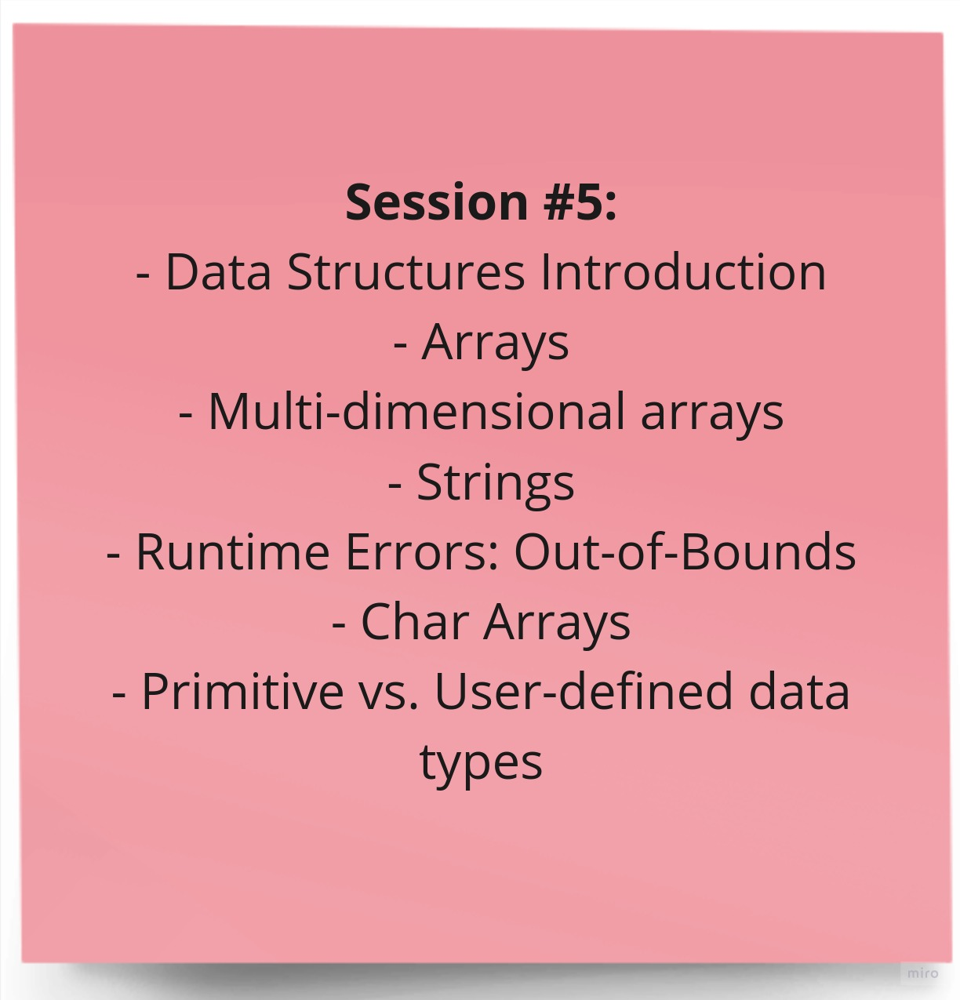

# Session 4

Welcome to the fifth session of the Introduction to Programming training! In this session, we covered more foundational concepts in C++ programming related to Arrays and Strings.

## Topics Covered

Here are some of the key topics we will cover in this session:

## Data Structures and Fundamental Data Types

### Arrays

* **Definition:** Arrays are a collection of data items of the same data type stored in contiguous memory locations. They allow efficient access and manipulation of data.

* **Key Characteristics:**
    * Fixed size: Arrays have a predetermined size that cannot be changed dynamically during program execution.
    * Indexed access: Elements in an array are accessed using indices, which start from 0.

### Strings

* **Definition:** Strings are sequences of characters, typically used to represent text. They are treated as special arrays of characters.

* **Key Characteristics:**
    * Variable length: Strings can grow or shrink as needed during program execution.
    * Null-terminated: Strings are typically terminated by a null character ('\0') to indicate the end of the string.

### Primitive vs. User-Defined Data Types

* **Primitive Data Types:**
    * Basic data types provided by the programming language.
    * Examples: integers, floating-point numbers, characters, booleans.

* **User-Defined Data Types:**
    * Custom data types created by the programmer using programming constructs.
    * Examples: structures, classes, enumerations.

### Multi-Dimensional Arrays

* **Definition:** Arrays with more than one dimension, allowing data organization in a grid-like structure.

* **Applications:**
    * Representing images or matrices.
    * Storing data with multiple levels of categorization.

### Runtime Errors: Out-of-Bound

* **Description:** An error that occurs when accessing an element outside the valid range of an array or string.

* **Prevention:**
    * Using proper indexing within the valid range.
    * Implementing boundary checks to validate indices before accessing elements.

### Introduction to Data Structures

* **Definition:** Data structures are organized collections of data that provide efficient access, insertion, and deletion of data elements.

* **Types of Data Structures:**
    * Linear data structures: Lists, queues, stacks.
    * Non-linear data structures: Trees, graphs (we didn't talk about these yet).

* **Importance of Data Structures:**
    * Efficient data organization and retrieval.
    * Algorithm design and implementation.
    * Developing scalable and performant software applications.

## Session Materials

- [Session Slides (PDF)](session-5-slides.pdf) - Download the session slides to follow along.

- [Recorded Session (YouTube)](https://youtu.be/VBCc1ilclT0?si=bZ_e_SmV84Hp7qit) - If you missed the live session, you can watch the recorded video on our YouTube channel.

We hope you find this session informative and valuable as you continue your journey in programming. If you have any questions or need further assistance, please feel free to reach out.

***Happy learning!***
