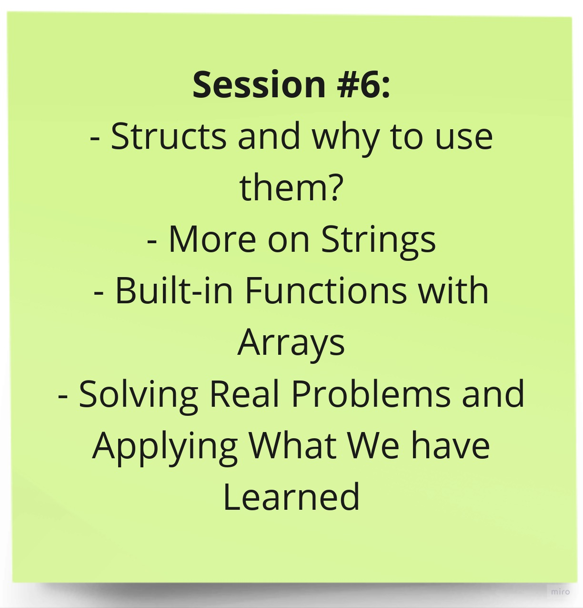

# Session 6

Welcome to the last session of the Introduction to Programming training! In this session, we dived deeper in one more important concept, which is the Struct. We talked about custom data types and why to use them. Furthermore, we solved a lot of problems together to discuss some notable details and to use what we have learned, as well as explain the structure of codeforces problems and how to think in a problem.


## Topics Covered

Here are some of the key topics we will cover in this session:



## Diving into Structs, Strings, and Codeforces: A Comprehensive Guide

### Delving into Structs in C++

Structs, also known as structures, are user-defined data types that allow you to group related data items together. They provide a way to organize data in a more meaningful and structured manner, enhancing code readability and maintainability.

**Defining Structs:**

```c++
struct Point {
  int x;
  int y;
};
```

This code defines a struct named `Point` with two members: `x` and `y`, both of type `int`.

**Accessing Struct Members**

```C++
Point p1;
p1.x = 10;
p1.y = 20;

std::cout << p1.x << " " << p1.y << std::endl; // Output: 10 20
```
In this example, a `Point` struct variable `p1` is created. Its members `x` and `y` are assigned values, and then their values are printed to the console.

### Exploring Strings in C++

Strings are sequences of characters used to represent text. C++ provides various built-in functions for manipulating strings.

**Common String Functions:**

* `String::size()` returns the size (length) of the string
* `String::front()` returns the first character of the string
*  `String::back()` returns the last character of the string

**You can search for more string functions online to learn how to use strings efficiently**

### Utilizing Built-in Functions with Arrays

C++ offers several built-in functions for working with arrays:

* `sizeof(arr)`: Returns the size (in bytes) of the array `arr`.

* `std::sort(arr, arr + n)`: Sorts the elements in the array `arr` in ascending order.

### Tackling Real-World Problems on Codeforces

Codeforces is a platform for competitive programming, offering a plethora of challenging problems to test your problem-solving skills as well as practicing these skills.

**Understanding Problem Structure:**

1. **Read and Comprehend:** Carefully read the problem statement and identify the key information.

2. **Identify Constraints:** Understand the constraints and limitations imposed on the problem.

3. **Visualize Input-Output:** Create examples or diagrams to visualize the input-output scenarios.

**Problem-Solving Approach:**

1. **Break Down the Problem:** Divide the problem into smaller, manageable subproblems.

2. **Choose Appropriate Data Structures:** Select appropriate data structures to efficiently represent the problem data.

3. **Design Algorithms:** Devise algorithms to solve each subproblem and the overall problem.

4. **Implement Solutions:** Translate the chosen algorithms into code, ensuring correctness and efficiency.

5. **Test and Debug:** Thoroughly test the code against various input cases to identify and fix any bugs.

### Important Details to Consider:

* **Corner Cases:** Handle edge cases and invalid input scenarios.

* **Code Readability and Maintainability:** Write clear, well-commented code that is easy to understand and maintain.

## Session Materials

- [Session Slides (PDF)](session-6-slides.pdf) - Download the session slides to follow along.

- [Recorded Session (YouTube)](https://youtu.be/v5qOOWbDGuA?si=rWo_ilY_pMutJGJD) - If you missed the live session, you can watch the recorded video on our YouTube channel.


We hope you find this session informative and valuable as you continue your journey in programming. If you have any questions or need further assistance, please feel free to reach out.

***Happy learning!***
